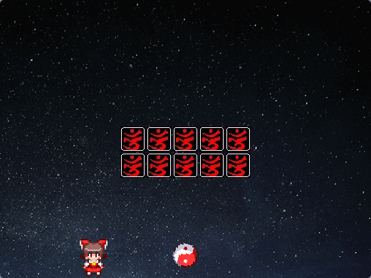

# Scratch-HRTP

This project was created as an assignment for the [CS50](https://cs50.harvard.edu/x/2023/psets/0/scratch/) course.

Scratch-HRTP is a game created in Scratch, inspired by the first Touhou game, ["Highly Responsive to Prayers"](https://en.wikipedia.org/wiki/Highly_Responsive_to_Prayers). In this game, you'll embark on a challenging journey through 5 stages filled with obstacles, and your goal is to break all the tiles with a yin-yang orb while staying alive.

## Gameplay

### Controls

- To start the game, press the **Space** bar.
- Move your character to the right using the **Right Arrow** key.
- Move your character to the left using the **Left Arrow** key.
- Use the **X** key to swing your wand and hit the yin-yang orb.
- To throw cards, press the **Z** key.

### Objective

Your objective is to break all the tiles on each of the 5 stages using the yin-yang orb. After completing these stages, prepare for an epic showdown with a challenging boss!

## Attributions

- **Sprites:**
  - Reimu, Elis and yin-yang orb sprites were sourced from [The Spriters Resource](https://www.spriters-resource.com/pc_computer/touhoupuppetdanceperformancetouhoumon/sheet/100669/).
  - Tile sprites are from the original game.
  - Bullet sprites were taken from [The Spriters Resource](https://www.spriters-resource.com/pc_computer/touhouseirensenundefinedfantasticobject/sheet/91834/).
  - Other sprites were either drawn by me or obtained from Scratch assets.

- **Sounds:**
  - The ball sound was sourced from [FreeSound](https://freesound.org/people/sandyrb/sounds/82712/).
  - Other sounds were obtained from Scratch assets.
